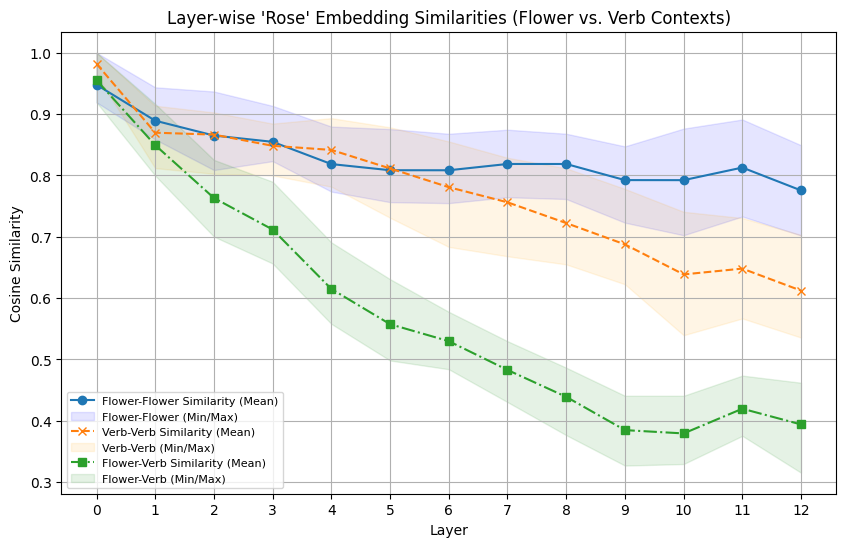
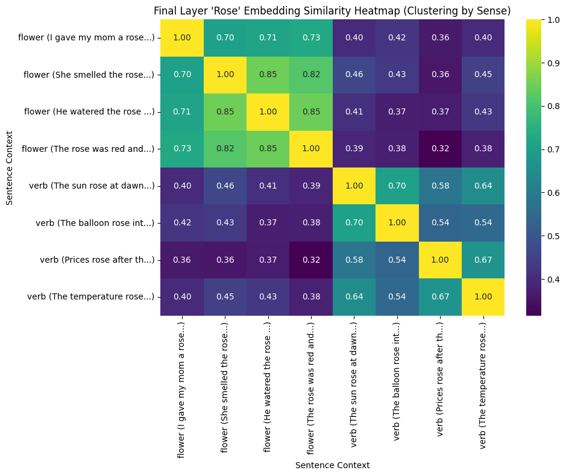

## 1. Problem and Motivation 
**What concept is being tested?**
This project investigates how contextual meaning is computed in transformer language models, specifically BERT, by analyzing the dynamic nature of contextual embeddings.

**Why is it non-obvious or interesting?**
It's non-obvious because traditional word embeddings are static. This experiment explores how BERT dynamically adjusts representations based on context, moving beyond static representations and suggesting that meaning is computed, not merely stored.

## 2. Hypothesis 
BERT embeddings for the ambiguous token 'rose' will dynamically diverge across layers when presented in sentences emphasizing different senses (flower vs. verb). Within-sense similarities (flower-flower or verb-verb) will remain high or increase, while between-sense similarities (flower-verb) will decrease in deeper layers, indicating contextual disambiguation.

**Explain what outcome would support or refute it.**
- **Support:** Cosine similarity between 'rose' embeddings from same-sense contexts (flower-flower or verb-verb) remains high, while similarity between different-sense contexts (flower-verb) significantly decreases in deeper layers.
- **Refute:** All similarities remain constant across layers, or flower-verb similarity remains high in deeper layers.

## 3. Experimental Design 
- **Model(s) used:** A pretrained `bert-base-uncased` model from Hugging Face, used as a frozen feature extractor.
- **Dataset or synthetic setup:** Custom-crafted pairs of sentences designed to clearly disambiguate the 'rose' token into either its noun (flower) or verb sense. Examples include: "I gave my mom a rose." (flower) and "The sun rose at dawn." (verb).
- **What is varied and what is held fixed:** The context of the ambiguous word 'rose' is varied to elicit different senses (flower vs. verb). The BERT model and the target token ('rose') are held fixed.
- **Why this experiment is sufficient to test the hypothesis:** By comparing cosine similarities of 'rose' embeddings across layers for within-sense and between-sense pairs, we can observe the dynamic evolution of its representation and quantify how BERT disambiguates meaning based on context.

## 4. Results 
- **Layer-wise Similarity Plot:**
    
    - **Flower-Flower Similarity:** Starts high (~0.95), remains high and stable, slightly decreasing to ~0.78 in deeper layers.
    - **Verb-Verb Similarity:** Starts high (~0.98), remains consistently high, slightly decreasing to ~0.61 in deeper layers.
    - **Flower-Verb Similarity:** Starts moderately high (~0.95), then drops significantly and consistently across layers, reaching ~0.39 in the deepest layers.
    
- **Final Layer Similarity Heatmap:** Shows clear blocks of high similarity for within-sense comparisons (flower-flower and verb-verb) and significantly lower similarity for between-sense comparisons (flower-verb), indicating strong clustering by semantic sense.

## 5. Analysis 
- The high and stable within-sense similarities indicate that BERT maintains consistent representations for 'rose' when the context implies the same meaning. The slight decrease suggests refinement of nuances even within the same sense.
- The significant divergence of flower-verb similarity in deeper layers demonstrates BERT actively disambiguates meaning. Early layers show more general embeddings, while deeper layers incorporate contextual cues to differentiate senses, pushing different-sense embeddings apart. This confirms dynamic computation and refinement of word meaning.

## 6. Conclusion 
**What did we learn?**
We learned that BERT produces highly contextualized word representations. Unlike static embeddings, the meaning of a word like 'rose' is not fixed but dynamically computed based on its surrounding context. Embeddings for the same word diverge significantly when its semantic role changes, highlighting BERT's ability to disambiguate meaning.

**What misconception does this clarify?**
This clarifies the misconception that word embeddings are static representations of words. Instead, it shows BERT's embeddings are dynamic, adapting to context, and computed rather than merely stored.

**What would change if assumptions were violated?**
If BERT did not dynamically contextualize, we would see no significant divergence between flower-verb similarities, or all similarities would remain high, indicating a lack of semantic disambiguation.

## 7. Limitations 
- BERT operates on WordPiece tokens, which sometimes requires aggregation for full words. This can complicate direct word-level interpretation.
- Cosine similarity captures overall closeness but doesn't identify specific linguistic features (e.g., tense, syntactic role) responsible for observed differences.
- This analysis uses a fixed, pretrained BERT model; fine-tuning for downstream tasks could alter these representations, emphasizing task-specific features over general semantic distinctions.